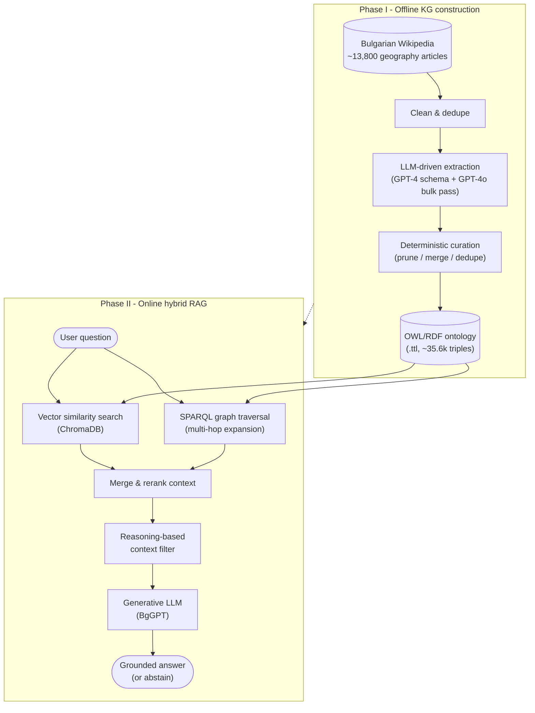

# GeoGraph

Mitigating Hallucinations in Low-Resource Large Language Models: A Case Study in Bulgarian

Yoan Salambashev, Melania Berbatova, Aleksandar Dimov - Faculty of Mathematics and Informatics, Sofia University "St. Kliment Ohridski"

## Abstract

Large Language Models (LLMs) frequently generate non-factual information, a limitation known as
hallucination. This challenge is severe in low-resource languages, where the scarcity of
high-quality training data hinders model reliability. This project implements a methodology to
mitigate hallucinations by grounding generation in a domain-specific Knowledge Graph (KG). It
introduces a Knowledge Graph-based Retrieval-Augmented Generation (KG-RAG) architecture, using
Bulgarian geography as a case study. To address the lack of structured semantic resources common
in such settings, it includes an iterative, LLM-driven pipeline that constructs a Knowledge Graph
from semi-structured Wikipedia text, followed by a deterministic curation stage that prunes and
consolidates the extracted graph. It also implements a hybrid retrieval mechanism that combines
vector similarity search with SPARQL-based graph traversal to capture complex, multi-hop
relationships. On a benchmark of 777 multiple-choice questions from Bulgarian matriculation
examinations, the KG-RAG system attains the highest overall accuracy among open, locally
deployable configurations (68.3%).

## Architecture

The system has two decoupled phases: an offline pipeline that builds the Knowledge Graph from
Wikipedia, and an online hybrid retrieval pipeline that answers questions against it.



A separate unstructured Vector RAG pipeline (chunking + embedding search only, no KG) is
included as a baseline to isolate the contribution of the structured knowledge graph.

## Repository layout

```
geograph/               Python package - all pipeline code
├── ontology/            KG construction & curation (LLM extraction, RDF/SPARQL, dedup/merge tools)
├── retrieval/           Vector store, embedding, reranking, chunking strategies
├── pipelines/           End-to-end RAG pipelines (KG-RAG, Vector RAG, chunking-strategy RAG)
├── llm/                 LLM clients (BgGPT, OpenAI) and prompt building
├── data_prep/           Wikipedia page cleaning / processing utilities
├── eval/                Evaluation and scoring utilities
├── runners/             CLI entry points for baselines, experiments, and ablations
├── api/                 FastAPI service exposing the pipelines over HTTP
├── config.py            Typed configuration dataclasses for every pipeline stage
└── constants.py         Model names, API endpoints, ontology namespaces, etc.

scripts/data_pipeline/  One-off scripts to fetch, split, clean and dedupe raw Wikipedia data

ontologies/             Versioned Turtle (.ttl) snapshots of the constructed knowledge graph
data/                   Raw fetched Wikipedia JSON, cleaned/deduplicated pages, parent-child chunk store
testset/                The 777-question benchmark, baseline outputs, and per-configuration eval runs
dataset/                Source matriculation exam questions/answers (by year) and testset-building scripts
raw_data/               Original matriculation exam PDFs and answer-key screenshots
reasoning_bg_dataset/   Geography subset pulled from the external ReasoningBG dataset for overlap checks
```

## Setup

1. `pip install -r requirements.txt`
2. Download and install [Ontotext GraphDB](https://www.ontotext.com/products/graphdb/) 10+ (used
   as the SPARQL endpoint for graph traversal).
3. Copy `geograph/.env.example` to `geograph/.env` and fill in your API keys.

### LLM backends

BgGPT - either download [BgGPT-Gemma-2-27B-IT](https://huggingface.co/INSAIT-Institute/BgGPT-Gemma-2-27B-IT-v1.0)
and run it locally, or request a hosted API key from INSAIT at `bggpt@insait.ai`.

OpenAI - used for KG extraction and the reasoning-based context filter. Create a key on the
[OpenAI platform](https://platform.openai.com/settings/organization/general).

Embeddings - the vector pipelines use [`rmihaylov/roberta-base-nli-stsb-bg`](https://huggingface.co/rmihaylov/roberta-base-nli-stsb-bg)
or `BAAI/bge-m3`; log in first via `huggingface-cli login` if the model requires it.

## Running

1. Start GraphDB and create a repository (e.g. `GeoGraphDB`).
2. Import `ontologies/huge_ontology_v3.ttl` (the fully curated graph; `huge_ontology.ttl` and
   `huge_ontology_v2.ttl` are earlier snapshots from the same curation pipeline, kept for lineage).
3. Run a pipeline, e.g.:
   ```bash
   python -m geograph.runners.run_kg_rag_batched
   python -m geograph.runners.run_experiment --pipeline kg_rag
   python -m geograph.runners.run_vector_chunking structure --ingest --evaluate
   ```
4. Or serve everything over HTTP: `uvicorn geograph.api.app:app --reload`.

All commands are run from the repository root.

## Data

- `data/` - raw Wikipedia JSON dumps fetched per geography category (`fetch-*.json`), plus
  `cleaned_data/` and `deduplicated_data/` (post-processing stages) and
  `parent_store_parentchild.jsonl` (the parent/child chunk store used by the chunking ablations).
- `ontologies/` - successive versions of the constructed knowledge graph in Turtle
  (`huge_ontology.ttl` -> `huge_ontology_v2.ttl` -> `huge_ontology_v3.ttl`), tracking the
  iterative extraction and curation pipeline; `huge_ontology_v3.ttl` (~35.6k triples) is the
  final curated graph.
- `testset/` - the 777-question Bulgarian matriculation-exam geography benchmark
  (`geography_777_benchmark.jsonl`), baseline model outputs, and per-strategy KG-RAG / Vector RAG
  evaluation runs.
- `dataset/` + `raw_data/` - the original matriculation exam questions, answer keys, and
  source PDFs (2019–2026) that the benchmark was built from.
- `reasoning_bg_dataset/` - an additional geography question set sourced from the external
  [ReasoningBG](https://github.com/mhardalov/bg-reason-BERT) dataset, deduplicated against the
  benchmark above.
